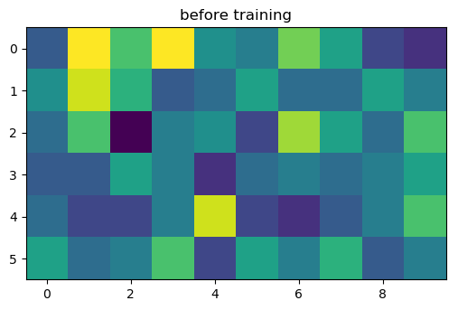

# SOM_Algorithm_C
Self organizing map (SOM) implementation in C

## Before training


## After training


## Final map
```
1110333333
1010032333
1110202333
1110222233
1110222233
1110222223

1 = Iris-setosa
2 = Iris-versicolor
3 = Iris-virginica
```

